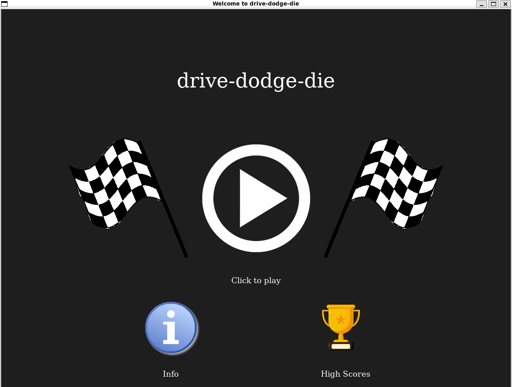

# drive-dodge-die

drive-dodge-die is a Python-based car racing game that uses the Model-View-Controller (MVC) architecture. The objective is to get to the checkpoint within the time limit while avoiding obstacles. The score is calculated based on how far you get and how quickly you can get there. The farther you get in the track, the more obstacles there will be. As the game goes on, you can get power ups so that you can accelerate more or hit obstacles without dying.


## Setup

### Get the code

To run this project, you can either clone the repository -

```
git clone https://github.com/olincollege/drive-dodge-die
```

or download the folder from github. This is done by pressing the green `<>Code` button and downloading the zip folder. Once you extract the zip folder, open it in VS code or CD into the folder.

### Dependencies

This project uses pygame, a Python library containing many game design elements, which can be installed by running the code below in your terminal.

```python
pip install -r requirements.txt
```

## Executing the game

To run the program, simply run main.py in your terminal. Or press the run button in VS code.

```python
python3 main.py
```

## Game Controls

The car is controlled on the track using keyboard inputs:  
Press the _up_ arrow key or `w` to accelerate  
Press the _down_ arrow key or `s` to decelerate  
Press the _left_ arrow key or `a` to move left  
Press the _right_ arrow key or `d` to move left  
_Click_ on power-up choices to choose them

## Authors

Antara Mazumdar, Ellie Kung, Yunzhu Chen
