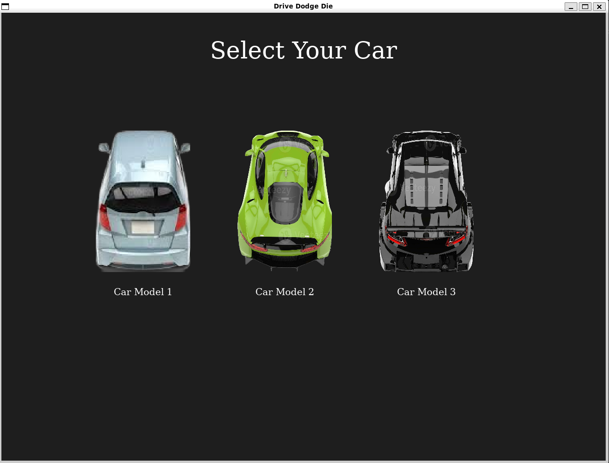
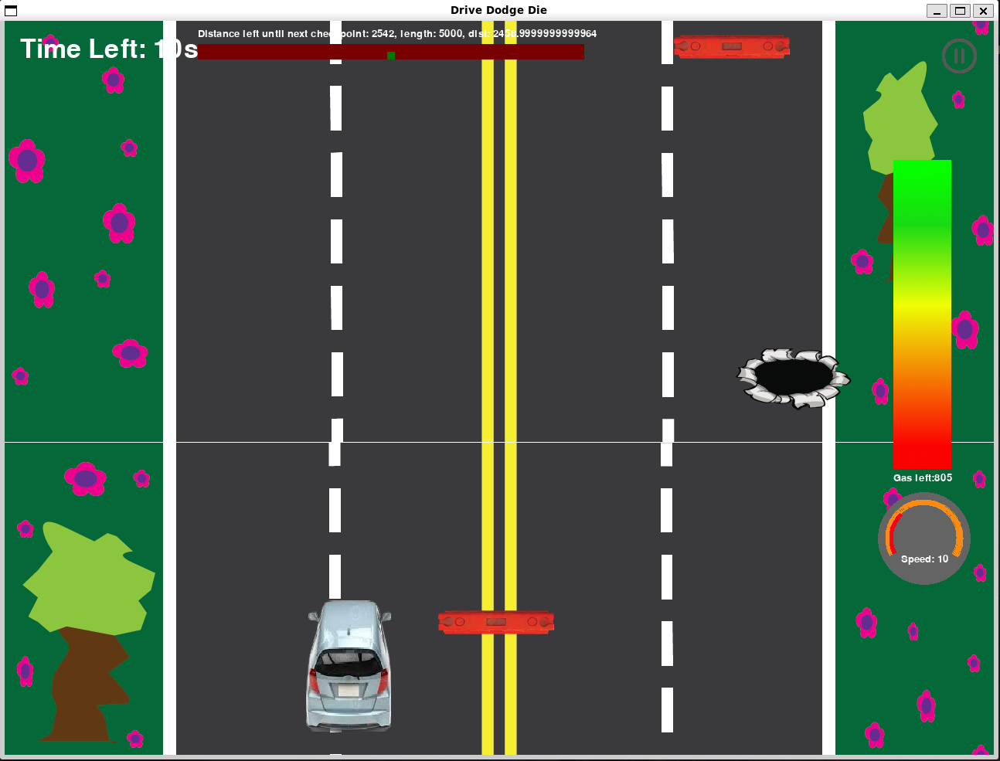
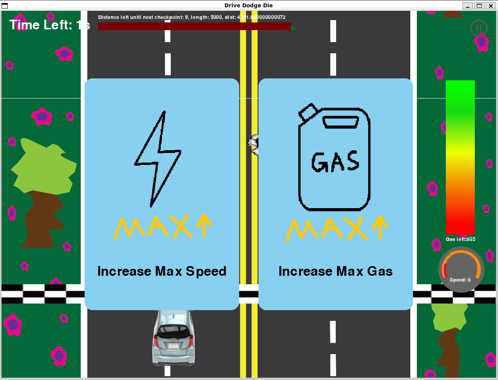

# drive-dodge-die
Welcome to the fast life - enter, if you dare!

## Overview
Your mission? Reach the checkpoint before time runs out, while skillfully dodging obstacles along the way.
Your score depends on both distance and speed: the farther you progress, the tougher the challenge becomes, with an increasing number of hazards cluttering the track. Fortunately, power-ups are scattered throughout the race, giving you an edge by boosting acceleration or granting temporary immunity against collisions.
It’s a test of reflexes, strategy, and endurance — can you navigate the chaos and make it to the finish line?

Are you ready to  
__drive__  
__dodge__  
or __die__?

## Features
You can choose from 3 cars which vary in speed range and acceleration abilities.  
  
You'll __drive__ your chosen car on a track with dangerous obstacles -- holes and barriers.  
Drive carefully and __dodge__ them, or crash on them and __die__!
  
Your car's current speed and gas storage is shown on the right. Acceleration will consume gas, and once you run out of it, you can no longer speed up. When you're not accelerating, the gas will automatically refill.  
The minimap at the top shows length of the road till the next checkpoint and the car's current position.  
  
Once you hit the checkpoint, you can choose from two power-ups that make your car stronger. There're five in total -- play the game and explore it yourself!
You will also get extra time automatically at checkpoints. However, the distance between checkpoints get longer and longer as the game goes, so drive fast!  

## Game Controls
Press the _up_ arrow key or _w_ to accelerate  
Press the _down_ arrow key or _s_ to deccelerate  
Press the _left_ arrow key or _a_ to move left  
Press the _right_ arrow key or _d_ to move left  
_Click_ on power-up choices to choose them

## Play the Game!
To play the game, go to our repo: https://github.com/olincollege/drive-dodge-die
and download as a zip file or clone the repository. Then install the requirements and you are ready to play!
For more specific instructions, read the README in our repository.

## Contributors
Antara Mazumdar, Ellie Kung, Yunzhu Chen
