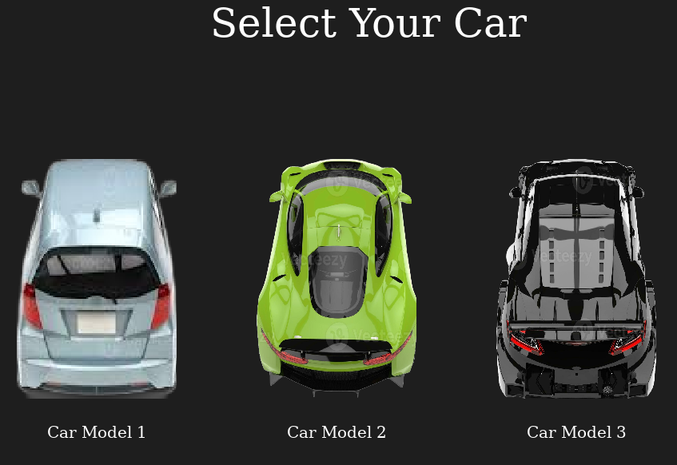

# drive-dodge-die
Welcome to the fast life - enter, if you dare!

## Overview
Your mission? Reach the checkpoint before time runs out, while skillfully dodging obstacles along the way.
Your score depends on both distance and speed: the farther you progress, the tougher the challenge becomes, with an increasing number of hazards cluttering the track. Fortunately, power-ups are scattered throughout the race, giving you an edge by boosting acceleration or granting temporary immunity against collisions.
It’s a test of reflexes, strategy, and endurance — can you navigate the chaos and make it to the finish line?

Are you ready to  
__drive__  
__dodge__  
or __die__?

## Features
You can choose from 3 cars which vary in speed range and acceleration abilities.

## Game Controls
Press the _up_ arrow key or _w_ to accelerate  
Press the _down_ arrow key or _s_ to deccelerate  
Press the _left_ arrow key or _a_ to move left  
Press the _right_ arrow key or _d_ to move left  

## Contributors
Antara Mazumdar, Ellie Kung, Yunzhu Chen
